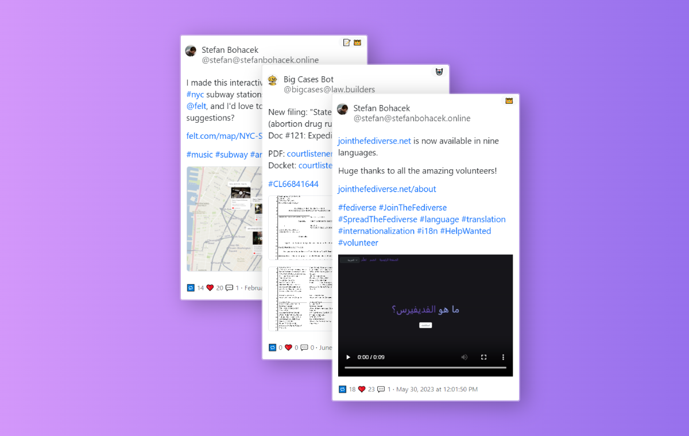
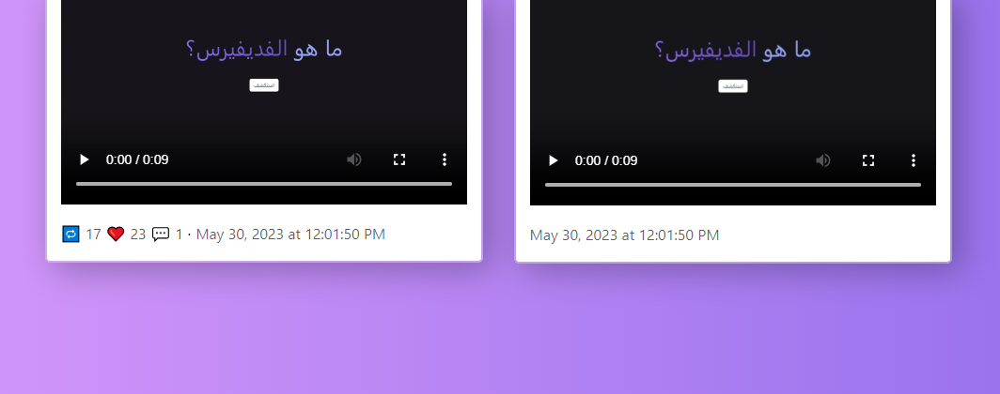
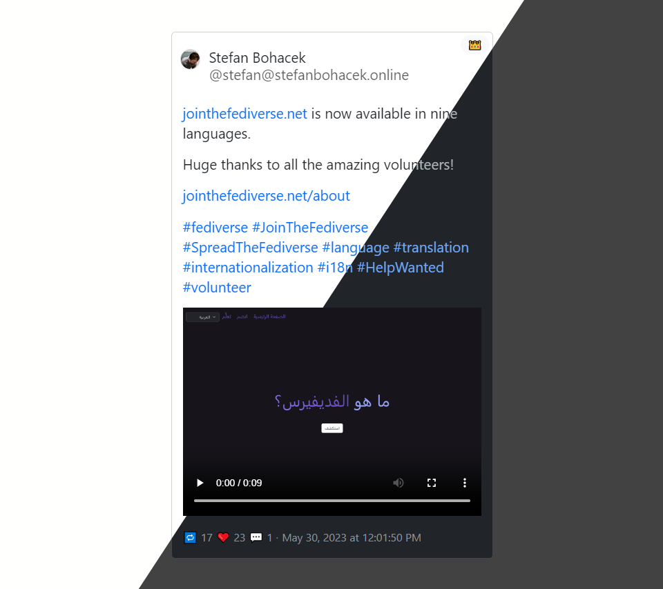

# Fediverse Embeds

Embed fediverse posts on your WordPress site. Read about the motivation behind this project [on my blog](https://stefanbohacek.com/project/wordpress-plugin-for-fediverse-embeds/).

This plugin is ***under active development*** and will be available on wordpress.org/plugins [once ready](https://github.com/stefanbohacek/fediverse-embeds-wordpress-plugin/milestone/1). In the meantime, you can download it from this repo and [install it manually](https://wordpress.com/support/plugins/install-a-plugin/#install-a-plugin-with-a-zip-file).

Feedback and help will be very appreciated!

- see [open issues](https://github.com/stefanbohacek/fediverse-embeds-wordpress-plugin/issues?q=is%3Aissue+is%3Aopen+sort%3Aupdated-desc) or [create a new one](https://github.com/stefanbohacek/fediverse-embeds-wordpress-plugin/issues/new)
- [contact](https://stefanbohacek.com/contact/)


A few examples of the plugin in use:

- [stefanbohacek.com](https://stefanbohacek.com/blog/a-netizens-guide-to-mastodon-fediverse/)
- [botwiki.org](https://botwiki.org/blog/what-kind-of-bots-are-posting-in-the-fediverse/)

## Features

- **Show or hide post metrics**



- **Automatic dark and light theme**



- **Labels for bots 🤖 and server admins 👑 (optional)**
- **Labels for updated 📝 and deleted posts 🗑️** (see notes on [how deleted posts are handled](https://github.com/stefanbohacek/fediverse-embeds-wordpress-plugin/issues/1))

## How to use

<!-- 1. [Install the plugin.](https://wordpress.org/plugins/ftf_fediverse_embeds) -->
1. Download and install the plugin.
2. Add the embed code to your post.

## Supported platforms

| **Platform**  | **Supported**   |
|---------------|-----------------|
| **Mastodon**  | ✔️ [How to embed](https://fedi.tips/how-to-embed-mastodon-posts-on-a-website/) |
| **Pleroma**   | ❌              |
| **Akkoma**    | ❌              |
| **Friendica** | ❌              |
| **Misskey**   | ❌ [#17](https://github.com/stefanbohacek/fediverse-embeds-wordpress-plugin/issues/17)          |
| **Calckey**   | ❌ [#16](https://github.com/stefanbohacek/fediverse-embeds-wordpress-plugin/issues/16)          |
| **Peertube**  | ❌ [#2](https://github.com/stefanbohacek/fediverse-embeds-wordpress-plugin/issues/2)           |
| **Pixelfed**  | ❌ [#14](https://github.com/stefanbohacek/fediverse-embeds-wordpress-plugin/issues/14)          |

## Development

```sh
# install dependencies
npm install
# build front-end scripts and styles
npm run dev
# when adding new PHP classes inside `includes`
composer dumpautoload -o 
```

## FAQ

### Images or posts are not loading

#### Embed code

[In some cases](https://github.com/stefanbohacek/fediverse-embeds-wordpress-plugin/issues/20), the `mastodon-embed` might be missing. Please make sure the embed code has it.

#### API Endpoints

Please make sure that you're not blocking `/wp-json/ftf/*` endpoints, either via a plugin like [Disable WP REST API](I:\OneDrive\Projects\WordPress\Plugins\fediverse-embeds\git\README.md), or through server configuration or your firewall.

Note that individual servers have an option to prevent this plugin from loading data, see more details [below](#how-do-i-prevent-this-plugin-from-embedding-my-posts).
### How can I run my own code after all embeds are processed?

The plugin fires a custom `ftf_fediverse_embeds_posts_processed` event that passes the list of processed embeds. Here's an example of how it can be used:

```js
document.addEventListener('ftf_fediverse_embeds_posts_processed', (event) => {
    console.log(event.detail);

    event.detail.forEach(embed => {
        // do something with each embed
    });
});
```

### How do I prevent this plugin from embedding my posts?

The plugin will use the following user agent when making requests to your fediverse servers:

```
FTF: Fediverse Embeds; WordPress/VERSION; https://WEBSITE.COM
```

`VERSION` is the version of the WordPress website making the request, and `WEBSITE.COM` is its URL, this is the default user agent used by WordPress.

The admin of your instance can then block any requests where the user agent contains `FTF: Fediverse Embeds`.
